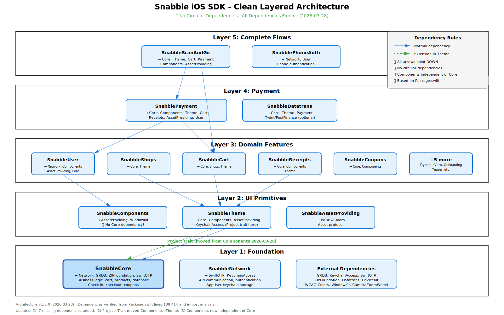

# Snabble


[](https://github.com/snabble/snabble-ios-sdk/actions)
[](https://twitter.com/snabble_io)


snabble - the self-scanning and checkout platform.

## Introduction

Starting with the 0.22.2 release, Snabble officially supports installation via [Swift
Package Manager](https://swift.org/package-manager/).

Prior to version 0.22.2 only Cocoapods is supported

## Requirements

### Version 1.0.0+ (Swift 6.2)
- **Xcode:** 17.0 or above
- **iOS:** 17.0 or above
- **Swift:** 6.2
- **Breaking Changes:** See [SDK Consumer Migration Guide](documentation/SDK-Consumer-Migration-Guide.md)

### Version 0.74.x and earlier
- **Xcode:** 15.4 or above
- **iOS:** 17.0 or above
- **Swift:** 5.10

See [Package.swift](Package.swift) for detailed platform versions.

### Installing from Xcode

Add a package by selecting `File` → `Add Packages…` in Xcode’s menu bar.

Search for the Snabble Apple SDK using the repo's URL:
```console
https://github.com/snabble/snabble-ios-sdk.git
```

Next, set the **Dependency Rule** to be `Up to Next Major Version` and specify `1.0.0` as the lower bound.

**Note:** For SDK versions before 1.0.0, specify `0.22.2` as the lower bound.

Then, select **Add Package**.

Choose the Snabble products that you want installed in your app.


### Alternatively, add Firebase to a `Package.swift` manifest

To integrate via a `Package.swift` manifest instead of Xcode, you can add
Firebase to the dependencies array of your package:

```swift
dependencies:[
  .package(
    name: "Snabble",
    url: "https://github.com/snabble/snabble-ios-sdk.git",
    .upToNextMajor(from: "1.0.0")
  )
]
```

**Note:** For SDK versions before 1.0.0, use `from: "0.22.2"`

Then, in any target that depends on a Firebase product, add it to the `dependencies`
array of that target:

```swift
.target(
  name: "MyTargetName",
  dependencies: [
    // The product(s) you want (e.g. SnabbleCore).
    .product(name: "SnabbleCore", package: "Snabble"),
  ]
)
```

### Optional components

In order to use the `twint` and `postFinanceCard` payment methods, you will also need to include `'SnabbleDatatrans'` as package in your app. During the app's initialization phase you will then need to call `DatatransFactory.initialize()` with your app's registered URL scheme to make these methods available.

Note that support for these payment methods also requires changes to your app's `Info.plist` as described in Datatrans' SDK [documentation](https://docs.datatrans.ch/docs/mobile-sdk#section-additional-requirements-for-i-os), as well as adding a URL scheme that can be used to pass data back to your app, e.g. by adding

```
<key>CFBundleURLTypes</key>
<array>
  <dict>
    <key>CFBundleTypeRole</key>
    <string>Editor</string>
    <key>CFBundleURLName</key>
    <string>YOUR_URL_NAME_HERE</string>
    <key>CFBundleURLSchemes</key>
    <array>
      <string>YOUR_URL_SCHEME_HERE</string>
    </array>
  </dict>
</array>
```

## Versioning

Snabble follows [semantic versioning](https://semver.org/) rules.
Note that we are currently in initial development, with major version 0. Anything may change at any time.

## Architecture

The Snabble iOS SDK follows a clean **layered architecture** with no circular dependencies:



**Key Features:**
- ✅ 5-layer modular structure (Foundation → UI Primitives → Domain Features → Payment → Complete Flows)
- ✅ No circular dependencies (resolved 2026-03-27, improved 2026-03-28)
- ✅ All dependencies explicit and verified from Package.swift
- ✅ Swift 6.2 with strict concurrency checking
- ✅ Clean separation of concerns

For detailed architecture documentation, see:
- [SDK Architecture Guide](documentation/SDK-Architecture.md)
- [Circular Dependencies Analysis](documentation/Circular-Dependencies-Analysis.md)

## Documentation

https://docs.snabble.io/docs/ios/

## Example project

The Example folder contains an extremely simple example for an app. To compile:

````
$ git clone https://github.com/snabble/snabble-ios-sdk
$ cd snabble-ios-sdk/Example
$ open SnabbleSampleApp.xcodeproj
````

To run this sample app, you will need an application identifier and a corresponding secret. [Contact us via e-mail](mailto:&#105;&#110;&#102;&#111;&#064;&#115;&#110;&#097;&#098;&#098;&#108;&#101;&#046;&#105;&#111;) for this information.


## What's new

With this version, the **Scan&Go** module `SnabbleScanAndGo` is available as a SwiftUI component. This extension allows you to integrate the entire Scan&Go workflow by simply calling `ShopperView(model: Shopper)`.

To create a `Shopper` you must be checked into a `Shop`:
```Swift
import SnabbleScanAndGo

final class AppState: ObservableObject {
   @Published var shop: Shop? {
        didSet {
            if let shop {
                self.shopper = Shopper(shop: shop)
            } else {
                self.shopper = nil
            }
        }
    }
   @Published var shopper: Shopper?
   ...
}
```
You can now start a **Scan&Go** session with a `Shopper` instance:
```Swift
import SnabbleScanAndGo

public struct ShoppingContainer: View {
    @EnvironmentObject var appState: AppState
    
    public var body: some View {
        if let model = appState.shopper {
            ShopperView(model: model)
        } else {
            ShopperLoadingView()
        }
    }
}
```
All actions during a **Scan&Go** session are performed in `ShopperView`. This includes:
- Selection of a payment method that has not yet been configured with forwarding to the respective input form.
- Selection of an already configured payment method.
- Adding scanned items to the shopping basket.
- Managing the shopping cart (changing article quantities, deleting articles).
- Search mask for manual entry of barcodes.
- Performing a payment process with checkout.
- Error handling during a Scan&Go session

## Author

snabble GmbH, Bonn
[https://snabble.io](https://snabble.io)

## License

snabble is (c) 2021-2025 snabble GmbH, Bonn. The SDK is made available under the [MIT License](https://github.com/snabble/iOS-SDK/blob/main/LICENSE).
